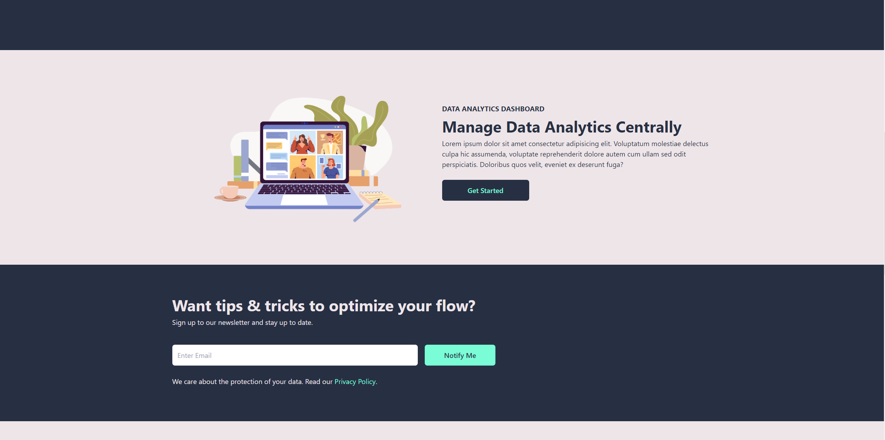

# Simple Landing Page using React.Js and Tailwind Css

This is my first React application using Tailwind Css. For creating this website I referred to Code Commerce's(https://www.youtube.com/channel/UCmT9TwcIb_yAe7-Uqhn3fBA) youtube video.

## Table of contents

- [Overview](#overview)
  - [Screenshot](#screenshot)
  - [Links](#links)
  - [Built with](#built-with)
  - [What I learned](#what-i-learned)

## Overview

#### Installation and Setup Instructions:

Clone down this repository. You will need `node` and `npm` installed globally on your machine.

Installation:

`npm install`

To Start Server:

`npm start`

To Visit App:

`localhost:3000`

### Screenshot





### Links

- Live Site URL: [Add live site URL here](https://your-live-site-url.com)

### Built with

- [React](https://reactjs.org/) - JS library
- [Tailwind Css](https://tailwindcss.com/) - For styles

### What I learned

-How to implement styles using tailwind css in a React.js application.
-How to create a mobile responsive web application in tailwind using concepts like flex and grid
-How to create a dynamic navbar with drawer animation

```

```
